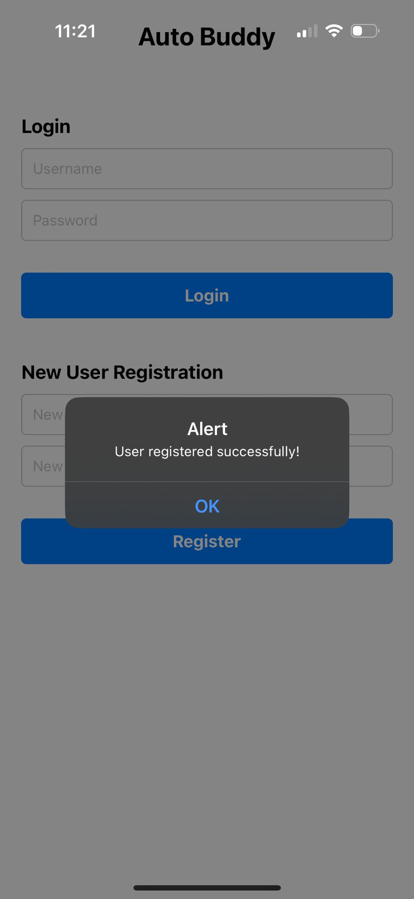
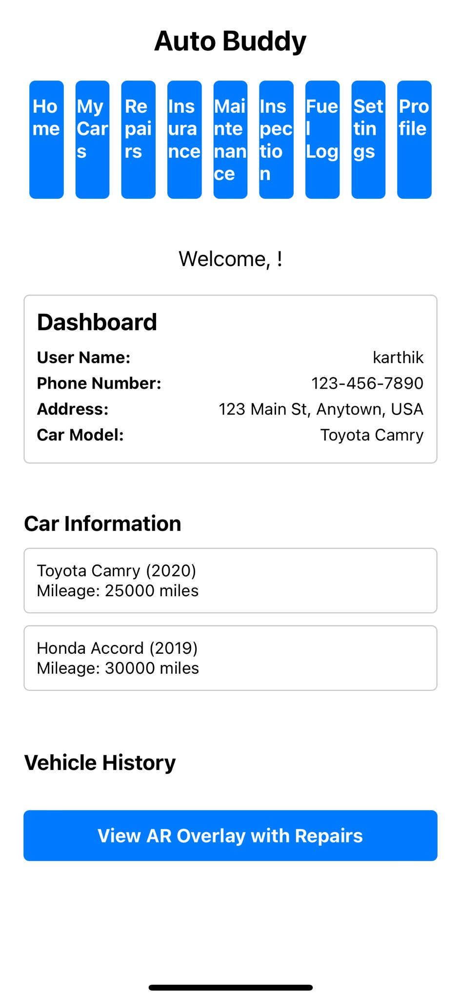
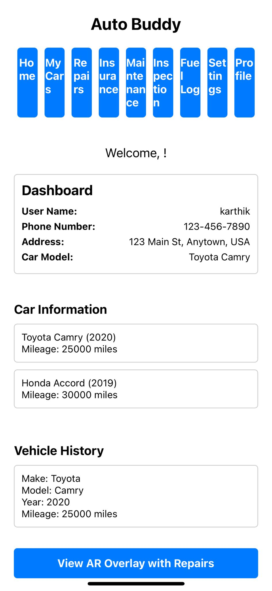

## Tech for MobileApps-Personalapp
## Team-Project-Team--22

Link of the Github Repository: [Click Here](https://github.com/RamisettyJayaSurya062002/techformobileapps-personalapp)

## Name of the Mobile App: Autobuddy

## Description:
Based on the supplied code, the Auto Buddy app's characteristics are described as follows:

# Auto Buddy:

Using React Native, Auto Buddy is a feature-rich vehicle management application. Car owners may monitor their vehicles, repairs, upkeep, insurance, and more using its user-friendly interface. These are the main features that the app provides:

# Verification of Users:

- Users can access their account by entering their password and username.
- By entering their username and password, new users can register.

# Car Administration:

- Add and oversee several of the user's automobiles.
- See comprehensive details about every vehicle, such as the model, year, make, and current mileage.
- Keep track of and examine each vehicle's repair history.
- Learn more about particular repairs, including the part that was fixed, the description of the repair.
- Keep a record of each vehicle's insurance information.
- Remember when your insurance is due for renewal.
- Keep track of and record regular maintenance tasks for every vehicle.
- Get alerts when there are scheduled maintenance services.
- View and edit the address, phone number, and name listed in the user profile.
- Adapt the options and settings of the app.
  
  
  
# Overlay of Augmented Reality (AR):
- Make use of augmented reality technology to see maintenance and repair instructions.
- By superimposing repair information on the actual car, you may have an immersive experience.
  

This project consists of the four major files named as: App.js, app.json, package-lock.json, package.json
# App.js

The primary part of the React Native application is contained in this file. It outlines the user interface's composition and capabilities. This is how the code is broken down:
- Component for navigation buttons: A reusable component that generates navigation buttons for the app's various sections.
- App component: The primary part responsible for managing the logic and state of the application.
- State variables for controlling user data, modal visibility, vehicle selection, registration, and authentication.
- Data sample for automobiles and repairs.
- Features that manage user registration, login, vehicle selection, and navigation.
- Rendering of different parts and components according to the user's level of authentication.
- Components such as the dashboard, AR overlay, car list, vehicle history, and login/registration forms.
- Styles: An object holding styles for various parts and components within the application.

# app.json
app.json

This file is an Expo project configuration file. It includes the application's settings and metadata, including:

- name: The application's name.
- slug: An application's special identification.
- version: The application's most recent iteration.
- orientation: The application's orientation (landscape or portrait).

Bundling patterns for assets are called assetBundlePatterns.
- iOS and Android: Device configuration parameters unique to each platform for iOS and Android.
- web: Web build configuration parameters.
Expo uses this file to set up the program and how it behaves across various platforms.

 # package.json

This file, which contains dependencies and metadata for the Auto Buddy program, is a configuration file for the Node.js project. What's in it is as follows:

name: The project's name ("autobuddy").

version: The project's 1.0.0 version as of right now.

main: Node_modules/expo/AppEntry.js, the application's entry point.

scripts: Scripts that are defined to run the program in various settings

start: Launches the development server for Expo.

android: Launches the application on an Android emulator or device and launches the Expo development server.

ios: Launches the application on an iOS simulator or device and launches the Expo development server.

web: Launches the application in a web browser and launches the Expo development server.

dependencies: Provides a list of the project's necessary dependencies.

Expo: The Expo SDK, which gives users access to a range of native services and APIs.

Expo-status-bar: A module designed to manage the Expo applications' status bar.

react: The user interface construction library React.

React Native may be used to create native mobile applications with the react-native library.

devDependencies: Enumerates the project's development dependencies.

JavaScript code can be transpiled using the @babel/core compiler core.

private: A signal that this package is private and shouldn't be added to a public registry.

The project's dependencies, scripts, and metadata must all be managed by this file in order for the program to be properly created, launched, and operated across several platforms.
